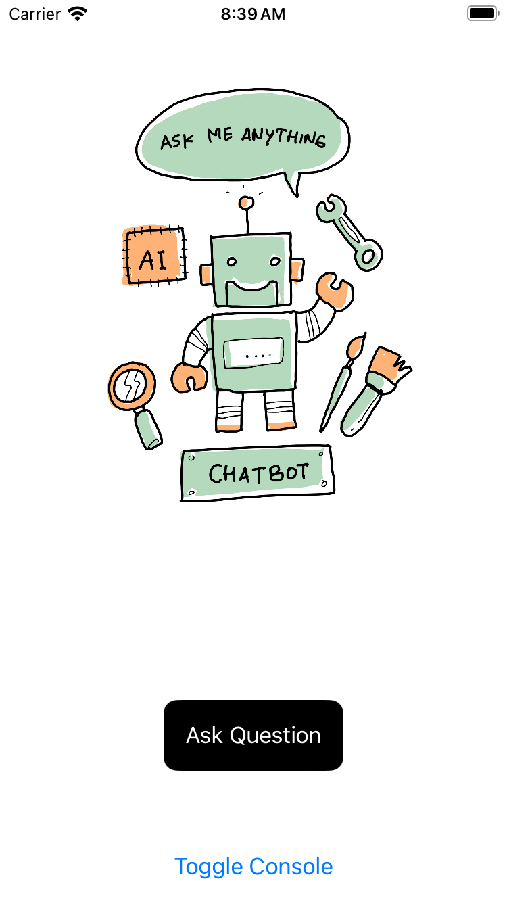
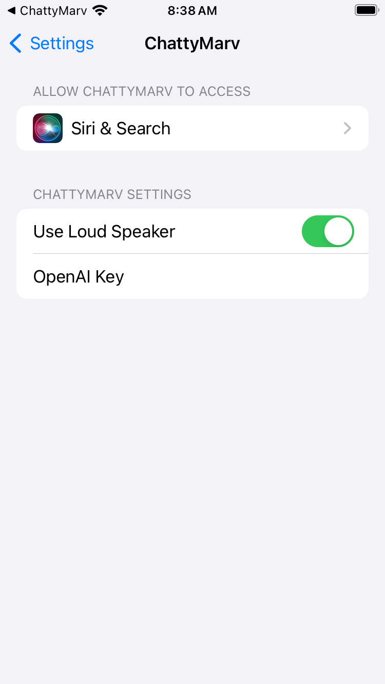

# ChattyMarv

ChattyMarv is an iOS application that provides an interactive chatting experience using OpenAI's GPT-4. Speak to ChattyMarv, and it will capture your speech, send the text to OpenAI's server, and speak the response back to you. Plus, keep track of your conversation with our built-in popup console!

## Features

- **Speech Recognition**: Converts user's voice to text.
- **OpenAI Integration**: Sends the recognized text to OpenAI server for intelligent responses.
- **Text-to-Speech**: Speaks the assistant's response.
- **Console**: Popup console to display the conversation between the user and the assistant.

## Screenshots


*Main Interface*


*Settings Interface*

## Installation

### Prerequisites

- Xcode 15.0 or later.
- iOS 17.0 or later.
- OpenAI API token (without this, the app won't work).
  
### Steps

1. Clone the repository:
    ```
    git clone https://github.com/hackzilla/ChattyMarv.git
    ```

2. Open `ChattyMarv.xcodeproj` with Xcode.
3. Install the SDWebImageSwiftUI dependency via Swift Package Manager (or however you've integrated it).
4. Enter your OpenAI API token in the specified location (e.g., `Constants.swift`).
5. Build and run the application on a simulator or a real device.

## Dependencies

- **SDWebImageSwiftUI**: Used for displaying animated images.

## Licensing & Attribution

ChattyMarv © 2023 by Daniel Platt is licensed under (CC BY-NC-SA 4.0)[http://creativecommons.org/licenses/by-nc-sa/4.0/]

Please note that ChattyMarv utilizes images sourced from (Pixabay)[https://pixabay.com/service/license-summary/], these images are not covered under the same license. Always check and respect the individual licenses of any assets you use or redistribute. If you need a list of specific images used, please reach out to the repository maintainers.

## Contribution

Interested in contributing? Fork the repository, make your changes, and submit a pull request. We appreciate all contributions and are always looking for ways to improve ChattyMarv.

## Issues & Support

If you encounter any issues or need support, please open an issue on the repository, and we'll do our best to assist you.

## Author

Daniel Platt - [Github](https://github.com/hackzilla)

If you find this project useful, consider [buying me a coffee](https://www.buymeacoffee.com/hackzilla).
